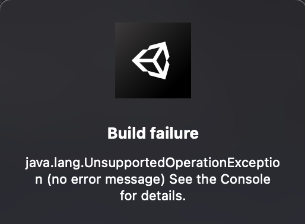

# Unity-Experience-Brian
Share my package, module and some experience in Unity

## Làm nhẹ Project Unity trước khi gửi đi. 
- Xoá các thư mục ko cần thiết đẩy lên, vì khi mở ở máy khác nó sẽ tự gen, download về : Library, Logs, Obj, Build, .apk, ..
- Các folder cần để là Assets, UserSettings , Project Settings, Package.

## Coroutine, Async / Await / Task trong Unity : 
- Link compare có example khá hay dễ hiểu cho người mới : https://viblo.asia/p/nang-cap-game-unity-cua-ban-bang-async-await-tasks-yMnKMjbzZ7P

## Unity 2021.3.13f build IOS bị lỗi cocoapods ko install được : 
1. Open terminal
2. Type: gem list
3. In my case, the list that resulted had all this:
Code (CSharp):
cocoapods (1.10.2)
cocoapods-core (1.10.2)
cocoapods-deintegrate (1.0.5)
cocoapods-downloader (1.6.3)
cocoapods-plugins (1.0.0)
cocoapods-search (1.0.1)
cocoapods-trunk (1.6.0)
cocoapods-try (1.2.0)
4. From that list, uninstall everything that references 'cocoapods'. Do this by typing the following for each 'cocoapods' reference you see: sudo gem uninstall cocoapods-core
5. Install homebrew.
6. Update homebrew: brew upgrade
7. Using homebrew, install Ruby brew install rbenv ruby-build
8. Update ruby: rbenv install 3.2.0
9. Set the new ruby version to global: rbenv global 3.2.0
10. Restart your computer.
11. Then reinstall cocoapods by entering: sudo arch -arm64 gem install -n /usr/local/bin cocoapods -v 1.10.2
12. Finish setup by typing pod setup
13. Restart the Unity Editor

## Unity 2021.3.13f - MacOS Ventura M1 - XCode 14.3 : Có Tích hợp Firebase khi build : 
- Có thể bị lỗi "Showing All Errors Only
Framework not found FBLPromises" hoặc "Showing All Errors Only
Linker command failed with exit code 1 (use -v to see invocation)"
- Để hiện .xcworkspace file trong folder build: Ta run terminal : pod update  hoặc pod install 
- Mở xcode bằng file .xcwordspace này. 
- To fix the Bitcode, I had to manually set Build Settings > Enable Bitcode = No for ALL the libraries in my project. In Unity-iPhone, and Pods file.
-> Khi mở dự án bằng Xcode, ta phải config trong Xcode, ở mọi nơi Unity-Iphone hoặc Pods : Trong Build Settings , tìm Enable Bitcode và chọn NO. 
-> Sau đó thì mình đã build được và không có lỗi. 
Có vẻ như " The BITCODE must be turned off everywhere since iOS 16: " 

## Unity - Android required API 33 for Android's build. 
- To build in API 33, In Publishing Setting, under Minify section, enable "Use R8" and make build with target api set to 33. For more information on Minify, can check, https://forum.unity.com/threads/wha...-should-i-change-it-before-publishing.870061/
- If not, you'll get error when trying build game. 

## Build Android Target 31 trở lên gặp lỗi : 

```
* What went wrong:
Execution failed for task ':launcher:transformClassesAndResourcesWithR8ForRelease'.
> java.lang.UnsupportedOperationException (no error message)
```
Hoặc lỗi khi upload .aab lên Google Store. 
- Đọc qua hướng giải quyết ở đây [Link](https://developers.google.com/ar/develop/unity-arf/android-12-build#workaround)
- Trong Project Setting > Publishing Settings : ấn sử dụng custom Main Manifest, Gradle template, Launcher... và làm theo hướng dẫn : 
Xoá comment, thêm android:exported="true"....
- Khi nhập sai pasword Keystore cũng báo lỗi. 

- Xoá folder library đi, khởi động lại Unity. Build lại. OK. Hoặc có thể thử chạy Android Resolver rồi chạy thử xem được ko. 

