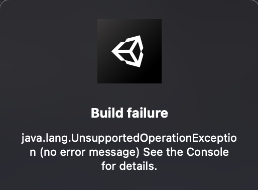

# Unity-Experience-Brian
Share my package, module and some experience in Unity

## Làm nhẹ Project Unity trước khi gửi đi. 
- Xoá các thư mục ko cần thiết đẩy lên, vì khi mở ở máy khác nó sẽ tự gen, download về : Library, Logs, Obj, Build, .apk, ..
- Các folder cần để là Assets, UserSettings , Project Settings, Package.

## Coroutine, Async / Await / Task trong Unity : 
- Link compare có example khá hay dễ hiểu cho người mới : https://viblo.asia/p/nang-cap-game-unity-cua-ban-bang-async-await-tasks-yMnKMjbzZ7P

## Unity 2021.3.13f build IOS bị lỗi cocoapods ko install được : 
1. Open terminal
2. Type: gem list
3. In my case, the list that resulted had all this:
Code (CSharp):
cocoapods (1.10.2)
cocoapods-core (1.10.2)
cocoapods-deintegrate (1.0.5)
cocoapods-downloader (1.6.3)
cocoapods-plugins (1.0.0)
cocoapods-search (1.0.1)
cocoapods-trunk (1.6.0)
cocoapods-try (1.2.0)
4. From that list, uninstall everything that references 'cocoapods'. Do this by typing the following for each 'cocoapods' reference you see: sudo gem uninstall cocoapods-core
5. Install homebrew.
6. Update homebrew: brew upgrade
7. Using homebrew, install Ruby brew install rbenv ruby-build
8. Update ruby: rbenv install 3.2.0
9. Set the new ruby version to global: rbenv global 3.2.0
10. Restart your computer.
11. Then reinstall cocoapods by entering: sudo arch -arm64 gem install -n /usr/local/bin cocoapods -v 1.10.2
12. Finish setup by typing pod setup
13. Restart the Unity Editor

## Unity 2021.3.13f - MacOS Ventura M1 - XCode 14.3 : Có Tích hợp Firebase khi build : 
- Có thể bị lỗi "Showing All Errors Only
Framework not found FBLPromises" hoặc "Showing All Errors Only
Linker command failed with exit code 1 (use -v to see invocation)"
- Để hiện .xcworkspace file trong folder build: Ta run terminal : pod update  hoặc pod install 
- Mở xcode bằng file .xcwordspace này. 
- To fix the Bitcode, I had to manually set Build Settings > Enable Bitcode = No for ALL the libraries in my project. In Unity-iPhone, and Pods file.
-> Khi mở dự án bằng Xcode, ta phải config trong Xcode, ở mọi nơi Unity-Iphone hoặc Pods : Trong Build Settings , tìm Enable Bitcode và chọn NO. 
-> Sau đó thì mình đã build được và không có lỗi. 
Có vẻ như " The BITCODE must be turned off everywhere since iOS 16: " 

## Unity - Android required API 33 for Android's build. 
- To build in API 33, In Publishing Setting, under Minify section, enable "Use R8" and make build with target api set to 33. For more information on Minify, can check, https://forum.unity.com/threads/wha...-should-i-change-it-before-publishing.870061/
- If not, you'll get error when trying build game. 

## Build Android Target 31 trở lên gặp lỗi : 

```
* What went wrong:
Execution failed for task ':launcher:transformClassesAndResourcesWithR8ForRelease'.
> java.lang.UnsupportedOperationException (no error message)
```
Hoặc lỗi khi upload .aab lên Google Store. Build
- Đọc qua hướng giải quyết ở đây [Link](https://developers.google.com/ar/develop/unity-arf/android-12-build#workaround)
- Trong Project Setting > Publishing Settings : ấn sử dụng custom Main Manifest, Gradle template, Launcher... và làm theo hướng dẫn : 
Xoá comment, thêm android:exported="true"....
- Khi nhập sai pasword Keystore cũng báo lỗi. 

- Xoá folder library đi, khởi động lại Unity. Build lại. OK. Hoặc có thể thử chạy Android Resolver rồi chạy thử xem được ko. 

## Build hiện cảnh bảo useR8 deprecated - Xoá nó đi : 
- Trong Player Publishing Settings : Tích chọn Custom Launch Gradle Template và bỏ tích chọn Use R8 trong Minify. 
- sau đó vào file custom đó, comment dòng useR8 lại là được. 


## Build Unity 2021.3.13 với Admob 8.6 bị lỗi - Unity cần sử dụng link tới gradle 6.7.1 riêng ko theo recommend default: 
- Đã thử nhiều cách nhưng chưa được. 
- Thử các bước sau : 
    + Cài đặt lại theo thứ tự : Admob -> Firebase (AppCheck, Analysis, Message) -> Reimport all. 
    + Thực hiện theo lưu ý trên trang Google Admob - thay đổi Gradle (link)[https://developers.google.com/admob/unity/gradle]
    + Lỗi này bị với Unity 2022.1 and earlier
    + Sau đó build lại là được. 

## Build WebGL : Interacting with JS Web Client : 
- Error when build : Error building WebGL in 2021.2.5f1 - ebug_WebGL_wasm\build.js: undefined symbol

- Solved : 
For those wondering how to use the '-s ERROR_ON_UNDEFINED_SYMBOLS=0' argument:
Go to ProjectSettings folder and open ProjectSettings.asset
Search for webGLEmscriptenArgs
Add the argument in front of it, like webGLEmscriptenArgs: -s ERROR_ON_UNDEFINED_SYMBOLS=0
That solved the issue for me


## Build WebGL Release - Brotli : 
- Got Error : I get this error when executing my webgl build in Chrome.

Unable to parse Build/SampleScene.framework.js.br!
If using custom web server, verify that web server is sending .br files with HTTP Response Header "Content-Encoding: br". Brotli compression may not be supported over HTTP connections. Migrate your server to use HTTPS.

- Resolved : 
To fix this issue go to files>build settings>player settings>Publishing settings and from there just turn on "Decompression Fallback" option and create a webGL build again and it should work properly over local server or any server you will upload your project

## Unity build dự án cho IOS, run bằng Xcode bị lỗi, ko có file .xcworkspace : 
- Khi mở bằng file .xcodeproj  Có thể bị lỗi mở lên ko có cocoapods, hoặc archive/run thì bị lỗi gì đó. 
- Dự án build ra không có file .xcworkspace : Ta cần chạy pod update để cài đặt sinh ra file này . 

- Để cho chắc , chạy lần lượt các terminal sau tại folder builds đó : 
    + sudo xcode-select --switch /Applications/Xcode.app/Contents/Developer
    + gem install cocoapods --user-install
    + sudo gem install cocoapods
    + pod update
- Sau đó thì trong folder build sẽ có file .xcworkspace, ấn mở file này bằng Xcode. 
- Sau đó tuỳ chỉnh như bình thường, ấn archive//run dự án. 

## Unity build trên Xcode, chạy archive bị lỗi `Invalid Bundle. The bundle at 'HeroOfLighthalzen.app/Frameworks/UnityFramework.framework' contains disallowed file 'Frameworks'.`
- [Link hướng dẫn](https://stackoverflow.com/questions/73902406/unityframework-framework-contains-disallowed-file-frameworks-getting-this-err)

- Các bước : 
Click on Unity-iPhone project
Click on the UnityFramework Target
Click on the Build Settings
Search for "swift"
Set the "Always Embed Swift Standard Libraries" option to "No"


## Build Unity cho Android : lỗi > 1 exception was raised by workers:
  java.lang.RuntimeException: java.lang.RuntimeException: com.android.ide.common.signing.KeytoolException: Failed to read key samsungstore from store

  - Bị sai password của keystore. 


